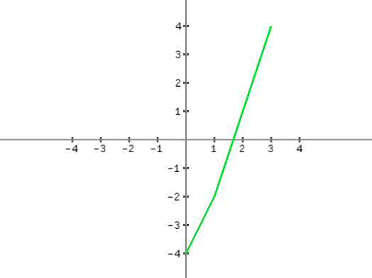
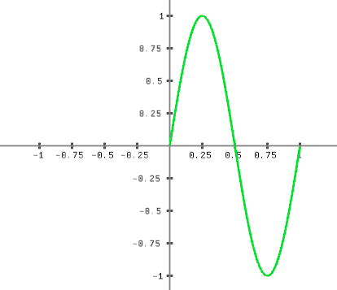

# graplot

Experimental plotting library written in Rust and based on [macroquad].

[macroquad]: https://github.com/not-fl3/macroquad

```rust
use graplot::Plot;

let plot = Plot::new([-4., -2., 1., 4.]);
plot.show();
```


Sine wave:
```rust
use graplot::Plot;

let mut xs = [0.; 1000]; 

let mut add = 0f64;
for idx in 0..1000 {
    xs[idx] = add/1000.;
    add += 1.;
}
    
let mut ys = [0.; 1000];
for (i, y) in ys.iter_mut().enumerate() {
    *y = (2. * std::f64::consts::PI * xs[i]).sin();
}

let plot = Plot::new((xs, ys));
plot.show();
```


