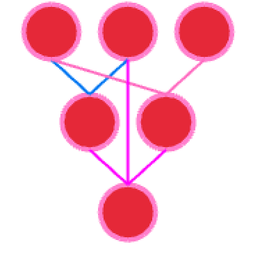

# graplot

[](https://crates.io/crates/graplot)
[](https://docs.rs/graplot/0.1.21/graplot/)

'graplot' is an experimental plotting library written in Rust that is based on [macroquad] (internally [litequad]).
It creates a window displaying the graphs.

[macroquad]: https://github.com/elftausend/macroquad
[litequad]: https://github.com/elftausend/litequad

## Installation

Add 'graplot' as a dependency:
```toml
[dependencies]
graplot = "0.1.21"
```

## [Examples]

[Examples]: https://github.com/elftausend/graplot/tree/main/examples

```rust
use graplot::Plot;

let plot = Plot::new([-4., -2., 1., 4.]);
plot.show();
```


3D line plot:

```rust
use graplot::Plot3D;

let xs = [0.,1.,2.,3.,4.,5.,6.];
let ys = [0.,1.,4.,9.,16.,25.,36.];
let zs = [0.,1.,4.,9.,16.,25.,36.];

// move with: W, A, S, D
let plot = Plot3D::new((xs, ys, zs, "r-o"));
plot.show();
```


Multiple graphs:
```rust
use graplot::Plot;

let xs = [1., 2., 3.,];
let ys = [1.7, 3., 1.9];

let ys1 = [1.4, 1.6, 1.5];    

let ys2 = [0.9, 1.2, 1.7, 1.9, 2.];    

let mut plot = Plot::new((xs, ys));
plot.add((xs, ys1, "c-o"));
plot.add((ys2, "r-"));
plot.show();
```


Label the x and y axis and set a title:

```rust
use graplot::{x, Plot};

let mut plot = Plot::new((|x: f64| x.cos(), x(6.)));

plot.set_title("cosine wave");

plot.set_xlabel("x axis");
plot.set_ylabel("y axis");
plot.show();
```


[Collatz Conjecture]:

[Collatz Conjecture]: https://github.com/elftausend/graplot/blob/main/examples/collatz.rs


Draw pie charts:

```rust
use graplot::Pie;

// without labels: let pie = Pie::new([35., 25., 25., 15.]);
let draw = [(35., "label"), (25., "len"), (25., "labeled"), (15., "test")];
let pie = Pie::new(draw);
pie.show();
```


Sine wave:
```rust
use graplot::Plot;

let mut xs = [0.; 1000]; 

let mut add = 0f64;
for idx in 0..1000 {
    xs[idx] = add/1000.;
    add += 1.;
}
    
let mut ys = [0.; 1000];
for (i, y) in ys.iter_mut().enumerate() {
    *y = (2. * std::f64::consts::PI * xs[i]).sin();
}
// or alternatively: let plot = Plot::new((|x: f64| x.sin(), x(4.)));
let plot = Plot::new((xs, ys));
plot.show();
```


x³ + x² - 0.08:
```rust
use graplot::{Plot, x};

// x(...) ... sets the absolute max value for x 
let plot = Plot::new((|x: f64| x.powf(3.) + x.powf(2.) - 0.08, x(1.)) );
plot.show();
```


x² - 0.5:
```rust
use graplot::Plot;

let plot = Plot::new(|x: f64| x.powf(2.) - 0.5);
plot.show();
```


Use the Polynomial struct or polynomial() function to create a polynomial function that runs through all given points:

```rust
use graplot::{x, Plot, Polynomial};

let poly = Polynomial::new(&[2., 3., 1.], &[2., 3., 2.]);
let plot = Plot::new((poly, x(10.)));
plot.show();
```


Draw bar graphs:

```rust
use graplot::Bar;

let mut bar = Bar::new(["Ferris", "Stefan", "Test"], &[100., 200., 700.]);
bar.set_title("title");
bar.set_xlabel("test");
bar.show();
```


Using a line description: (matplotlib)

```rust
use graplot::Plot;

// c ... cyan color, - ... solid line, o ... ring marker
let plot = Plot::new(([-4., -3., -3.4, -3.75, -4.1], "c-o"));
plot.show();
```


Draw graphs with nodes and egdes:

```rust
use graplot::{Graph, RED, graph::GraphDesc, Color};

let mut graph = Graph::new();
graph.graph_desc = GraphDesc {
    node_color: RED,
    outer_ring: (Color::new(1., 0.5, 0.8, 1.), 3.5),
    ..Default::default()
};
let a = graph.add_node(vec![]);
let b = graph.add_node(vec![]);
let c = graph.add_node(vec![]);

let d = graph.add_node(vec![a.idx, b.idx]);
let e = graph.add_node(vec![a.idx, c.idx]);

graph.add_node(vec![d.idx, e.idx, b.idx]);

graph.show();
```



Custom scaling:

```rust
use graplot::{Desc, Plot, x};

let mut plot = Plot::new((|x: f64| x.cos(), x(2.)));
plot.set_desc(Desc {
    min_steps_x: 6.,
    spacing_x: 47.,
    ..Default::default()
});
plot.show();
```


Spawning multiple windows on linux (currently not working):

```rust
let mut plot = Plot::new(|x: f64| x.powf(3.) + x.powf(2.) - 0.08);
plot.set_title("x^3 + x^2 - 0.08");
let h = plot.show_threaded() // show_threaded() is currently linux only;

let mut plot = Plot::new(|x: f64| x.powf(2.) + 0.08);
plot.set_title("x²");
plot.show();

h.join().unwrap() // you need to close both windows
```


## Changelog

- 0.1.21: added graphs (nodes, edges)
- 0.1.19: negative value bars
- 0.1.18: bugfixes
- 0.1.17: basic 3d plotting
- 0.1.16: coloring,
- 0.1.15: easier colored bars
- 0.1.14: ???
- 0.1.13: added pie charts
- 0.1.12: added bar graphs
- 0.1.11: added scatter plots
- 0.1.10: create polynomial functions with a set of points
- 0.1.9: fixed bug
- 0.1.8: set color now uses 3 args, fixed step size
- 0.1.7: Set graph color, custom x & y "line" spacing and step size | "custom scaling"
- 0.1.6: Label x axis, litequad
- 0.1.5: y axis, set title, /*mutliple windows on linux*/ | yanked
- 0.1.4: Multiple graphs